# Humanos vs. IA en gestión de cobranza

[](https://github.com/MaxWell732/test-crecere/actions/workflows/ci.yml)
[](https://www.python.org/downloads/)
[](LICENSE)


---

## Resumen

Este repositorio compara el desempeño de agentes humanos frente a un agente de IA en cobranza telefónica, a partir de 100 llamadas en español (50 por grupo) entregadas como audio censurado.

El trabajo se divide en dos fases secuenciales e independientes:

| Fase | Entrada | Salida | Entorno |
|---|---|---|---|
| **1 · Extracción** | 100 WAV crudos | 3 tablas anónimas + diccionario (`data/cleaned/`) | `data_extraction/.venv` |
| **2 · Análisis** | Esas tablas | Notebook, 8 figuras e informe HTML | `.venv` (raíz) |

**Hallazgo central:** la IA cierra compromiso de pago en el **28 %** de las llamadas frente al **56 %** del equipo humano, una diferencia de **28 pp** (IC 95 % de 9 a 45, p = 0.008). La brecha no está en el cierre: está en **llegar al titular** y en **destrabar la objeción**.


---

## Arquitectura general

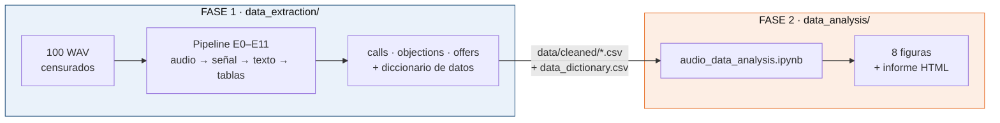

La frontera entre fases es deliberada: la Fase 2 **solo** consume `data/cleaned/`. Nada del análisis depende de los audios, así que el repositorio se puede publicar sin material sensible.

---

## Estructura del repositorio

```
crecere-audio-analytics/
│
├── data/
│   └── cleaned/                      # Única salida publicada de la Fase 1
│       ├── calls.csv                 # 100 filas × 107 columnas (una por llamada)
│       ├── objections.csv            # 97 objeciones (una fila por objeción)
│       ├── offers.csv                # 167 ofertas (una fila por oferta)
│       └── data_dictionary.csv       # 142 variables: tipo, fuente, fiabilidad
│                                     # (turns/ no se publica: contiene texto de la conversación)
│
├── data_extraction/                  # ───── FASE 1 ─────
│   ├── pyproject.toml                # dependencias (uv), script `extract`
│   ├── uv.lock                       # versiones exactas de la Fase 1
│   ├── .python-version               # 3.12
│   ├── .env.example                  # plantilla de variables de entorno
│   ├── configs/
│   │   ├── pipeline.yaml             # umbrales y parámetros operativos (v8)
│   │   ├── variables.yaml            # fuente única del diccionario de datos
│   │   ├── codebook.md               # reglas de anotación interpretativa (v3)
│   │   ├── lexicons.yaml             # léxicos: cortesía, muletillas, repetición
│   │   ├── diarization_overrides.yaml# ajustes de diarización por llamada
│   │   └── schemas/                  # JSON Schema de las pasadas A, B y roles
│   ├── scripts/
│   │   ├── env.sh                    # confina cachés y modelos al proyecto
│   │   ├── hf_login.sh               # token de Hugging Face 
│   │   └── smoke_test.sh             # prueba rápida sobre 3 llamadas
│   ├── src/extraction/
│   │   ├── cli.py                    # punto de entrada: 
│   │   ├── inventory.py              # E0  IDs anónimos, QC, detección de censura
│   │   ├── preprocess.py             # E1  copia 16 kHz para modelos
│   │   ├── vad.py                    # E2  Silero VAD, SNR, ratio de habla
│   │   ├── asr.py                    # E3  faster-whisper
│   │   ├── diarize.py                # E4  pyannote
│   │   ├── turns.py                  # E5  fusión palabra↔hablante, turnos
│   │   ├── roles.py                  # E6  asignación de roles + revisión humana
│   │   ├── canonical.py              # E7  JSON canónico y transcripciones
│   │   ├── features/
│   │   │   ├── dynamics.py           # E8a dinámica conversacional
│   │   │   ├── prosody.py            # E8b F0, intensidad, escalada vocal
│   │   │   ├── lexical.py            # E8c sentimiento, léxico, preguntas
│   │   │   └── embeddings.py         # E8d embeddings del discurso del agente
│   │   ├── annotation.py             # E9  validación de anotación interpretativa
│   │   ├── validation.py             # E10 acuerdo, WER, fiabilidad por variable
│   │   ├── tables.py                 # E11 tablas finales + diccionario
│   │   └── cache.py                  # caché por etapa con clave por hash
│   └── tests/                        # 10 módulos de pruebas (pytest)
│
├── data_analysis/                    # ───── FASE 2 ─────
│   ├── pyproject.toml                # dependencias del análisis (uv)
│   ├── uv.lock                       # versiones exactas de la Fase 2
│   ├── .python-version               # 3.12
│   ├── notebooks/
│   │   └── audio_data_analysis.ipynb # análisis completo, 8 secciones
│   └── outputs/
│       ├── images/                   # 8 figuras a 300 dpi
│       ├── tables/                   # tablas derivadas del análisis
│       └── results_report/
│           └── informe_humanos_vs_ia.html
│
├── .github/workflows/                # CI (ruff + 60 tests) y publicación del informe
├── LICENSE                           # MIT
└── README.md
```

---

## Cómo reproducirlo

Las dos fases son **entornos independientes**, cada uno con su propio `pyproject.toml` y su `uv.lock`.
Todo se gestiona con [uv](https://docs.astral.sh/uv/); la versión de Python (3.12) la instala el propio uv.

```bash
git clone https://github.com/MaxWell732/test-crecere.git
cd test-crecere
```

### Fase 2 · Análisis (lo único necesario para reproducir el informe)

No requiere los audios ni GPU: consume solo los CSV de `data/cleaned/`, que están en el repositorio.

```bash
cd data_analysis
uv sync                                  # instala las versiones exactas de uv.lock
uv run jupyter lab                       # abrir notebooks/audio_data_analysis.ipynb

# o reejecutar el notebook entero sin interfaz:
uv run jupyter nbconvert --to notebook --execute --inplace \
    notebooks/audio_data_analysis.ipynb
```

Salidas: las 8 figuras a 300 dpi en `data_analysis/outputs/images/` y las tablas en `outputs/tables/`.

> El informe `outputs/results_report/informe_humanos_vs_ia.html` lleva las figuras **embebidas en base64**,
> así que no se actualiza solo: hay que regenerarlo tras reejecutar el notebook.

### Fase 1 · Extracción (solo si se parte de los audios)

Requiere los 100 WAV originales —que **no** se publican— y una GPU con ≥ 4 GB de VRAM.

```bash
cd data_extraction                       # desde la raíz del repositorio
source scripts/env.sh                    # confina cachés, modelos y temporales al proyecto
uv sync                                  # ~170 paquetes, incluye torch cu126

cp .env.example .env                     # y completar HF_TOKEN, o bien:
scripts/hf_login.sh                      # guarda el token en .cache/huggingface/ (no en $HOME)

uv run extract check-env                 # verifica Python, CUDA, modelos y token
```

Aceptar antes los términos de los tres repos de pyannote que indica `.env.example`.

```bash
uv run extract audio-all                 # E0–E5 · audio → turnos (cada etapa en su propio proceso)
uv run extract features-all              # E8a–E8d · dinámica, prosodia, léxico, embeddings
uv run extract validate                  # E10 · acuerdo, WER, fiabilidad por variable
uv run extract tables                    # E11 · escribe data/cleaned/ + diccionario
```

`uv run extract --help` lista las 24 etapas. Cada una cachea por hash de configuración y de entradas,
así que reejecutar solo recalcula lo que cambió; `--force` lo fuerza y `--calls C001,C002` lo limita.

```bash
uv run pytest                            # 60 tests
uvx ruff check --select E4,E7,E9,F src tests
```

---

# FASE 1 · Extracción y arquitectura del pipeline

## Visión general

El pipeline convierte audio en tablas mediante doce etapas encadenadas (E0–E11), cada una con su propia caché. La clave de caché combina la configuración relevante y una huella de los archivos de entrada, de modo que reejecutar una etapa solo recalcula lo que realmente cambió.


## Secuencia de una llamada

Cómo se transforma un único archivo de audio, de la señal al dato analizable:

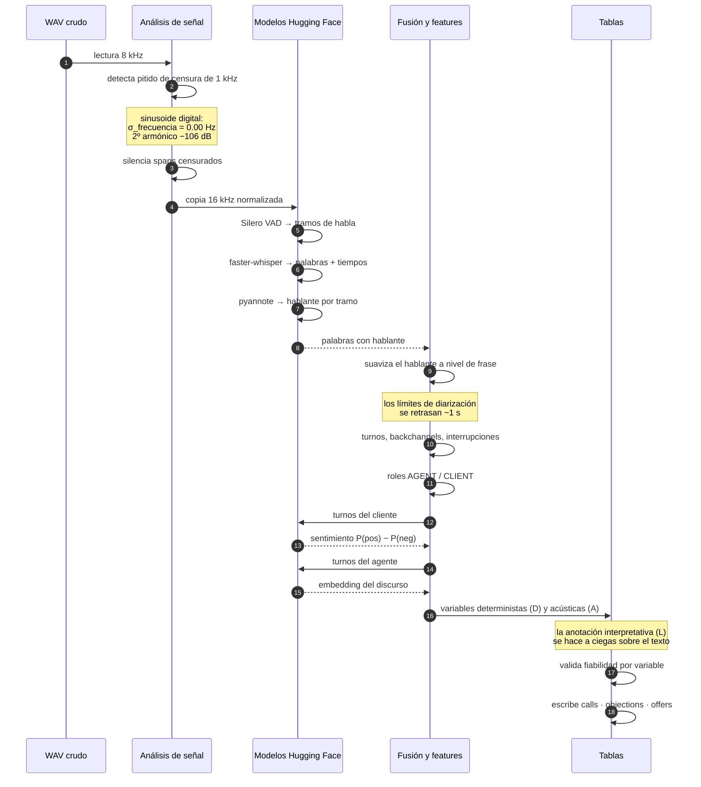

## Modelos de Hugging Face

| Etapa | Modelo | Rol en el pipeline | Por qué este |
|---|---|---|---|
| **E2** | `snakers4/silero-vad` | Detecta tramos de habla; base para SNR y ratio de habla | Ligero, robusto en audio telefónico de 8 kHz |
| **E3** | `faster-whisper large-v3`<br/>*fallback:* `large-v3-turbo` | Transcripción en español con marcas de tiempo **por palabra** | Las marcas por palabra son el insumo de la fusión con diarización. Ejecutado vía CTranslate2 en `int8` para caber en 4 GB de VRAM |
| **E4** | `pyannote/speaker-diarization-community-1`<br/>*fallback:* `pyannote/speaker-diarization-3.1` | Segmenta quién habla y cuándo | community-1 rinde mejor en llamadas cortas de 2 hablantes. Usa internamente `segmentation-3.0` y `wespeaker-voxceleb-resnet34-LM` |
| **E8c** | `pysentimiento/robertuito-sentiment-analysis` | Sentimiento por turno del cliente | RoBERTuito está entrenado en español informal de redes, más cercano al habla espontánea que un modelo de reseñas |
| **E8d** | `sentence-transformers/paraphrase-multilingual-MiniLM-L12-v2` | Embeddings de los turnos del agente | Mide cuánto se parece el discurso de un agente al de su propio grupo: un proxy de "hablar con guion" |

Dos ajustes no obvios que hicieron la diferencia:

- **Prompt inicial de dominio en el ASR.** Se le pasa a Whisper una frase con vocabulario de cobranza colombiana (*mora*, *cuota vencida*, *PSE*, *Efecty*, *Nequi*, *centrales de riesgo*). Sin él, el modelo transcribe mal los términos que más importan para codificar el resultado.
- **Suavizado del hablante a nivel de frase.** Los límites de pyannote se retrasan cerca de un segundo, así que el arranque de una frase caía en el hablante equivocado en un 3.5–6.2 % de las palabras. Una minoría corta dentro de una frase se reasigna al hablante mayoritario, y cada cambio queda registrado. Sin esto aparecen turnos, latencias e interrupciones falsos.

La prosodia (F0, intensidad, escalada vocal) usa **praat-parselmouth**, no un modelo neuronal: para medidas acústicas estándar, un algoritmo determinista es más auditable y reproducible.

## Las variables y por qué están

Cada variable declara su **fuente**, que determina cómo se valida:

| Fuente | Qué significa | Nº | Cómo se valida |
|---|---|---|---|
| `D` | Determinista, calculada desde señal o texto | 65 | Reproducible por construcción |
| `L` | Interpretativa, anotada a ciegas desde la transcripción | 51 | κ contra gold + autoconsistencia |
| `D over L` | Derivada de variables anotadas | 15 | Hereda la peor decisión de sus insumos |
| `A` | Acústica, medida sobre la señal | 11 | Reproducible por construcción |

### Por qué cada bloque

**Embudo y contacto** — `contact_type`, `es_titular`, `ptp`, `ptp_type_commitment`
> Sin esto no se puede separar *no llegar al cliente* de *no convencerlo*. Es la distinción que cambia la acción de negocio: un número equivocado se arregla en la base de datos, una objeción mal manejada se arregla en el guion.

**Resultado** — `final_outcome` (8 niveles ordinales), `ptp_confirmed_by_client`, `ptp_strength`
> Un binario "compromiso sí/no" trata igual una promesa vaga y una promesa firme confirmada. La escala ordinal permite preguntar si la ventaja se sostiene en todos los peldaños o solo en el primero.

**Dinámica conversacional** — `agent_latency_median_s`, `dead_air_s`, `agent_talk_share`, `interruptions_per_min_*`, `backchannels_agent_per_min`, `max_agent_monologue_s`
> Son las variables que separan "suena a persona" de "suena a máquina", y se miden sin tocar el contenido. La latencia y el silencio muerto resultaron ser las mayores ventajas humanas.
> Todas las tasas van **por minuto**: en crudo, una llamada larga infla los conteos y confunde duración con conducta.

**Negociación y ofertas** — `n_offers_agent`, `pct_ofertas_descuento`, `first_anchor`, tabla `offers`
> El costo de una concesión es dinero real. Modelar la oferta como fila propia permite preguntar *qué* se ofrece, *cuándo* y *con qué resultado*, en vez de un simple contador por llamada.

**Objeciones** — tabla `objections` con `type`, `agent_technique`, `resolved`
> Es el núcleo del diagnóstico. Con tipo y técnica por objeción se puede descomponer la brecha en **elegir mal la técnica** frente a **ejecutar mal la técnica elegida**, que son dos problemas con soluciones distintas.

**Cumplimiento** — `identifies_self`, `recording_notice`, `validates_identity_before_disclosing`, `states_amount`, `debt_disclosed_to_third_party`
> Riesgo regulatorio. Se separa en dos bloques a propósito: *regulatorio* (obligaciones legales) y *guion de cobro* (buenas prácticas comerciales). Mezclarlos oculta que la IA cumple mejor la ley y peor el guion.
> **Excluidos a propósito:** el cierre cortés, porque las grabaciones pueden estar truncadas; y el resumen del acuerdo, porque solo existe si hubo compromiso, así que filtraría el resultado dentro del predictor.

**Experiencia del cliente** — `sentiment_start/end/delta`, `client_escalation`, `client_expresses_annoyance`
> Un compromiso arrancado a un cliente furioso no es el mismo activo que uno acordado en calma. Mide el costo relacional de la gestión.

**Rúbricas 1–5** — `clarity`, `empathy`, `active_listening`, `objection_handling`, `control_focus`, `professionalism`
> Se conservan porque son el lenguaje del área de calidad, pero vienen de anotación no ciega y se leen **solo como apoyo**, nunca como evidencia principal.

**Calidad de señal** — `snr_db`, `clipping_pct`, `censored_s`, `asr_confidence`, `flags`
> Sin esto no se puede distinguir una diferencia real de un artefacto de grabación. Ejemplo concreto: la IA tiene mejor SNR (18.6 vs 11.6 dB) por su voz sintética, y como coincide casi por completo con el grupo **no se usa como control**: absorbería el efecto que se quiere medir.


---

# FASE 2 · Análisis e insights

## Flujo analítico

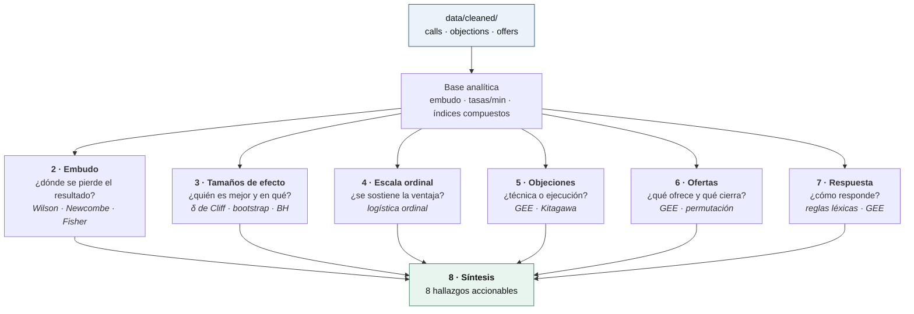

## Métodos y por qué cada uno

| Pregunta | Método | Razón de la elección |
|---|---|---|
| Proporciones con n pequeño | IC de **Wilson**; diferencias con **Newcombe** | Wald falla con proporciones extremas y n = 50 |
| Comparar métricas de escalas distintas | **δ de Cliff** + bootstrap de 2000 remuestras | No asume normalidad, acotado en [−1, 1], y en binarias coincide con la diferencia de proporciones |
| 25 comparaciones simultáneas | **Benjamini-Hochberg** | Controla la tasa de falsos descubrimientos sin la pérdida de potencia de Bonferroni |
| Resultado con 5 niveles ordenados | **Logística ordinal** + chequeo por punto de corte | Un binario descarta la diferencia entre promesa vaga y firme |
| Varias objeciones por llamada | **GEE logístico** agrupado por llamada | Las filas de una misma llamada no son independientes. Preferido a un modelo mixto: con ~1.5 objeciones por llamada el intercepto aleatorio queda mal identificado |
| ¿Mezcla o ejecución? | Descomposición de **Kitagawa** + bootstrap de conglomerados | Separa "elige peores técnicas" de "ejecuta peor la misma técnica" |
| Confusión no medida | **E-value** | Cuantifica cuán fuerte tendría que ser un confusor para anular el efecto |

## Hallazgos principales

### 1 · El embudo: la pérdida es temprana

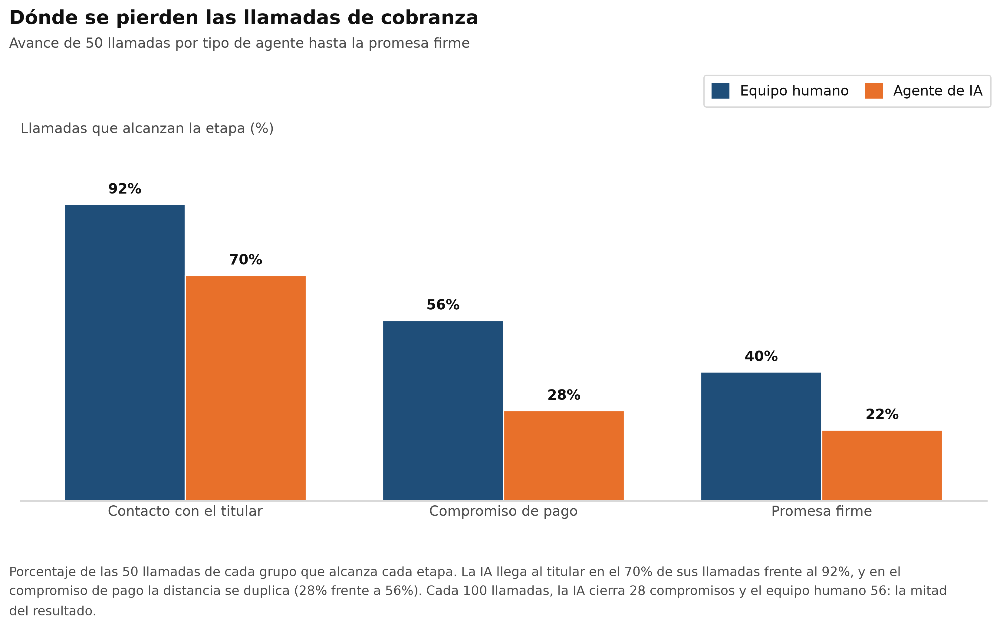

| Etapa | Humano | IA | Diferencia | p |
|---|---|---|---|---|
| Contesta una persona | 98 % | 92 % | −6 pp | 0.36 |
| **Contacto con el titular** | **92 %** | **70 %** | **−22 pp** | **0.009** |
| **Compromiso de pago** | **56 %** | **28 %** | **−28 pp** | **0.008** |
| Promesa firme | 40 % | 22 % | −18 pp | 0.083 |

Contestar el teléfono no distingue a los grupos. La separación empieza al llegar al titular y se duplica en el compromiso. Y **10 de los 15 contactos fallidos de la IA son números equivocados o terceros**: eso es calidad de base de datos, no conducta del agente.

Condicionando a haber hablado con el titular, la ventaja se reduce y deja de ser concluyente: 61 % vs 40 %, RR = 1.52, IC 95 % de la diferencia de −1 a 40 pp, p = 0.075. El E-value de 2.41 indica que un confusor tendría que asociarse 2.4 veces tanto con el grupo como con el resultado para anular la estimación. **Se reporta como evidencia sugestiva, no concluyente.**

### 2 · Dónde gana cada uno

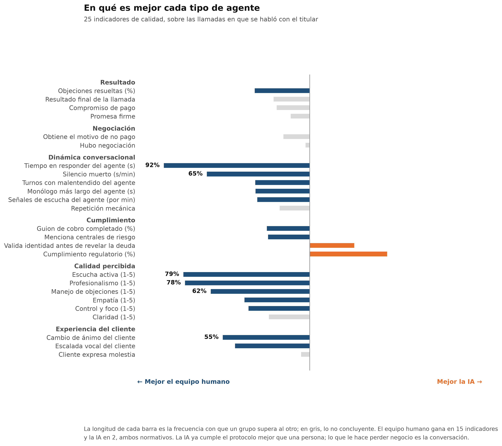

De 25 indicadores de calidad, los humanos ganan en **15** y la IA en **2** — ambas de cumplimiento regulatorio.

| Dimensión | Métrica | Humano | IA | δ de Cliff |
|---|---|---|---|---|
| Dinámica | Tiempo en responder | 0.74 s | 2.29 s | +0.92 |
| Dinámica | Silencio muerto | 0.7 s/min | 4.6 s/min | — |
| Experiencia | Cambio de ánimo del cliente | mejora | empeora | −0.55 |
| Calidad percibida | Escucha activa (1–5) | — | — | −0.79 |
| **Cumplimiento** | **Valida identidad antes de revelar la deuda** | **35 %** | **63 %** | **a favor de la IA** |

La lectura no es "la IA es peor": **ya cumple el protocolo mejor que una persona**. Lo que le hace perder negocio es la conversación.

### 3 · El resultado en toda la escala

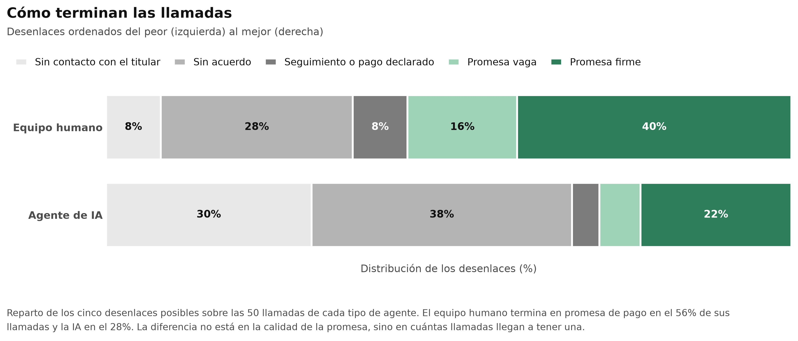

| Población | OR humano vs IA | IC 95 % | p |
|---|---|---|---|
| Todas las llamadas | **3.45** | 1.64 – 7.27 | 0.001 |
| Solo con el titular | 2.19 | 0.95 – 5.06 | 0.067 |

Los OR por punto de corte decrecen hacia la promesa firme (de 4.9 a 2.4), con IC solapados: la ventaja humana pesa más en los primeros peldaños —contactar y llegar a un acuerdo— que en la calidad final de la promesa.

### 4 · Objeciones: ¿mala técnica o mala ejecución?

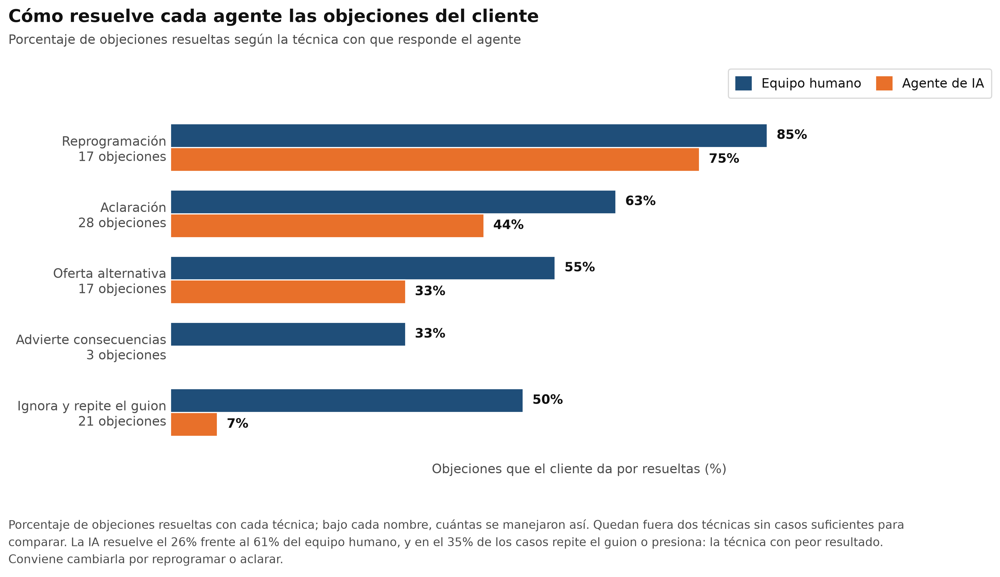

La IA resuelve el **26 %** de sus objeciones frente al **61 %** de los humanos (GEE: OR = 0.23, IC 95 % 0.09 – 0.59).

| Modelo | OR de la IA | IC 95 % | Lectura |
|---|---|---|---|
| A · Solo tipo de agente | 0.23 | 0.09 – 0.59 | Brecha cruda |
| B · + familia de técnica | 0.40 | 0.14 – 1.13 | Parte se explica por *qué* técnica elige |
| Guion o presión vs adaptativa | **0.16** | 0.06 – 0.41 | La técnica en sí reduce las odds a la sexta parte |

**Descomposición de Kitagawa:** 44 % de la brecha es *mezcla de técnicas*, 56 % es *ejecución*. Incluso usando técnicas adaptativas, la IA resuelve 47 % frente a 67 %. La IA recurre a guion o presión en el **35 %** de sus objeciones, frente al 19 % de los humanos.

### 5 · Ofertas: conceder no compra acuerdos

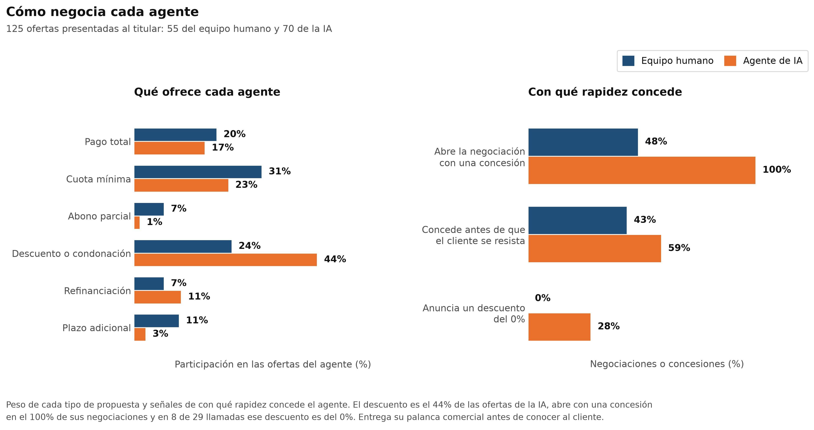
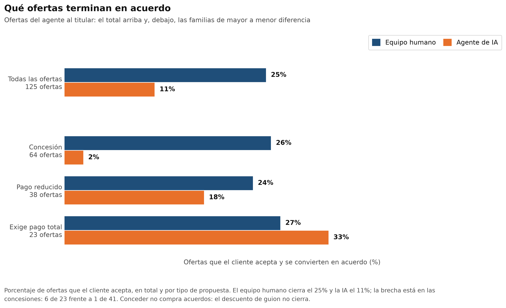

| Indicador | Humano | IA | p |
|---|---|---|---|
| Ofertas por llamada con negociación | 1.77 | 2.26 | 0.033 |
| Ofertas que son descuento o condonación | 24 % | 44 % | 0.021 |
| Abre la negociación con una concesión | 48 % | **100 %** (31/31) | < 0.001 |
| Anuncia un descuento del 0 % | 0 de 9 | **8 de 29** | 0.16 |
| **Ofertas aceptadas** | **25 %** | **11 %** | **0.033** |
| Concesiones que cierran acuerdo | 6 de 23 | **1 de 41** | — |

La IA **entrega su palanca comercial antes de conocer al cliente**, con una frase de guion: *"Queremos ofrecerle un descuento del X % de toda la deuda"*. En 8 llamadas ese descuento es del 0 %, porque el monto ofrecido iguala la deuda declarada. Ajustar por familia de oferta apenas mueve el OR (0.39 → 0.42): la menor aceptación **no** se explica por el tipo de oferta.

### 6 · Cómo responde a una objeción

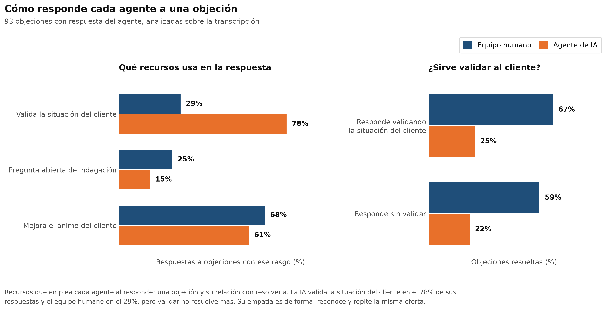
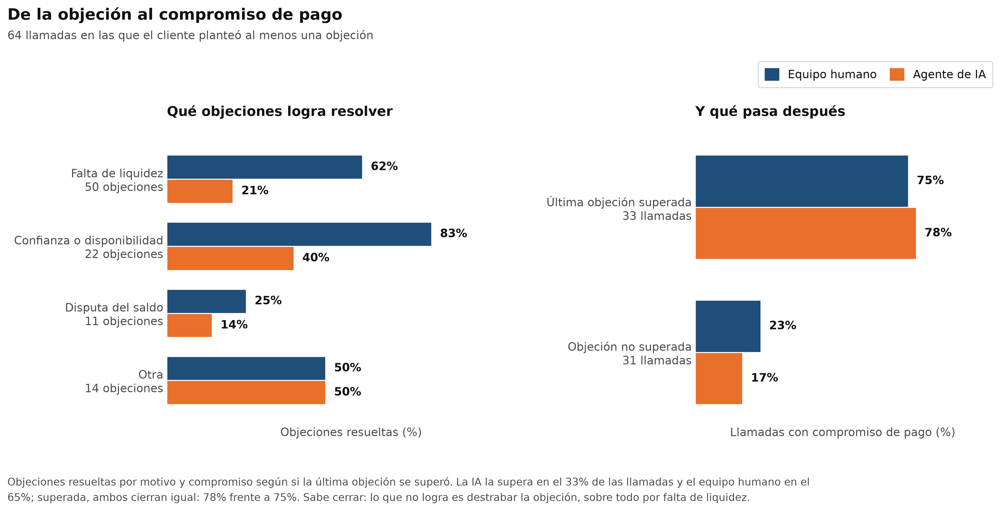

| Marcador | Humano | IA | q (BH) |
|---|---|---|---|
| Valida la situación del cliente | 29 % | **78 %** | < 0.001 |
| Pregunta abierta de indagación | 25 % | 15 % | 0.26 |
| Tiempo en responder (mediana) | 1.1 s | 3.3 s | < 0.01 |

Validar **no se asocia con resolver** la objeción (OR = 1.26, IC 95 % 0.44 – 3.63). La empatía de la IA es de forma: reconoce la situación y a continuación repite la misma oferta.

Y el dato que ordena la prioridad:

| | Humano | IA |
|---|---|---|
| Supera la última objeción | 65 % | 33 % |
| **Con la objeción superada, logra compromiso** | **75 %** | **78 %** |
| Sin superarla, logra compromiso | 23 % | 17 % |

**La IA sabe cerrar.** De los 20 pp de brecha en llamadas con objeciones, **18 pp** vienen de superar menos objeciones y solo 2 pp de convertir peor ante el mismo desenlace.


---


# Prueba técnica para el rol de Data Scientist en **Creceré AI**.

